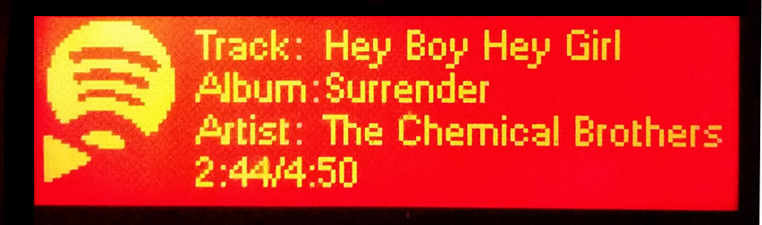

SpotifyStatusApplet
===================

An LCD Applet for the Logitech Gaming keyboard family (G510, G13, G15 etc) that displays current track information and Spotify playback status.

Spotify provides out-of-the box integration with the keyboard media keys, so SpotifyStatusApplet provides a mechanism to interact with Spotify without needing to open the application window.

Binaries & Installation
--------------------------------------
Binaries are available at http://lucaspardue.com/spotifystatusapplet

The applet is provided as a zip file that can be extracted to any location.

Running
--------------------------------------

SpotifyStatusApplet runs as a tray icon. Once launched, the icon can be right-clicked to bring up a context menu that allows the application to be exited.

is dependent on:

- An instance of Spotify running (of course!). The applet utilises the Spotify service SpotifyWebHelper.exe to access information, further details are available at [Spotify Local API](https://code.google.com/p/spotify-local-api/)
- A compatible [Logitech Gaming Keyboard](http://gaming.logitech.com/en-gb/gaming-keyboards) with LCD and official Logitech drivers / software installed. The software has only been tested on a G510 to date but support for all LCD equipped devices is expected.
- Windows and .Net. Tested on Windows 7 64-bit and .Net Framework 4.

Environment and Building
--------------------------------------

SpotifyStatusApplet is written in C# and has been developed using Visual Studio Express 2012 for Windows Desktop. A solution file is provided to gather all dependencies, it is anticipated this could be backported to support earlier versions of Visual Studio.

* Target .NET framework 4.5 and above.
* Install both the SpotifyAPI-NET and Newtonsoft.json Nuget packages.
* Enjoy!

Dependencies
--------------------------------------

SpotifyStatusApplet builds upon the great efforts of other developers/projects! The following software components are incorporated into the source tree to aid distribution

- [SpotifyAPI-NET](https://github.com/JohnnyCrazy/SpotifyAPI-NET) - A very simple and small library that allows .NET developers to get track information, (un)pause spotify, play tracks, get cover art and more! 
- [GammaJul LgLcd](http://gjlglcd.codeplex.com/) - A .NET wrapper around the Logitech SDK for G15/G19 keyboard screens. Supports raw byte sending, GDI+ drawing and rendering WPF elements onto the screen.
- [Newtonsoft.json](https://github.com/JamesNK/Newtonsoft.Json) - Newtonsoft.json is a popular high-performance JSON framework for .NET.
